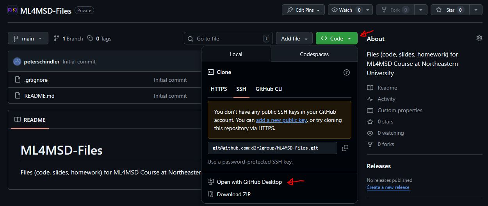
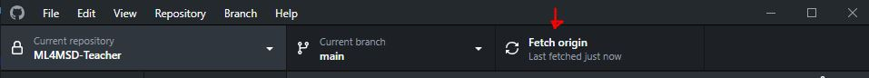
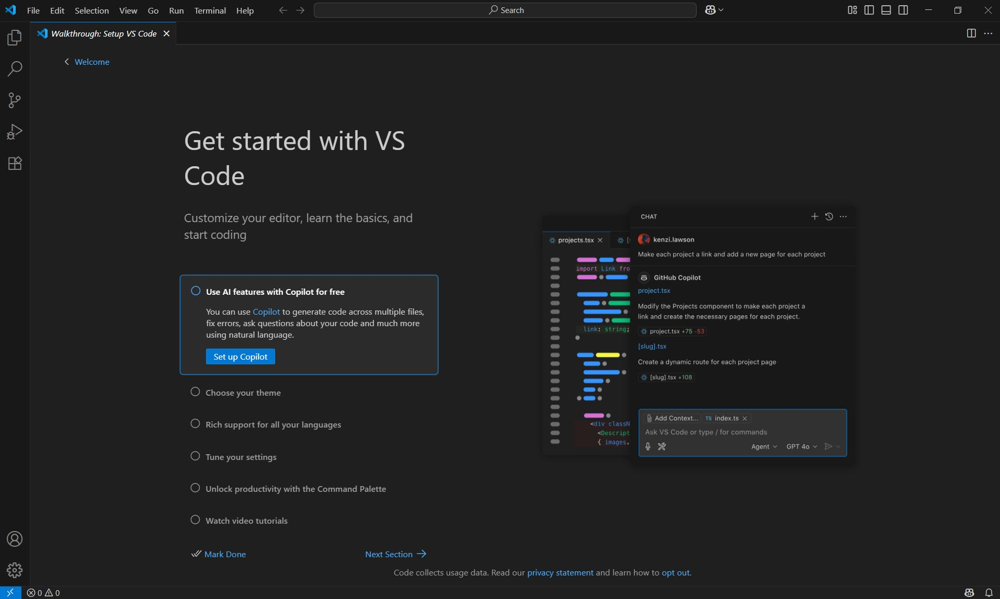
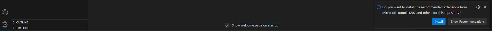
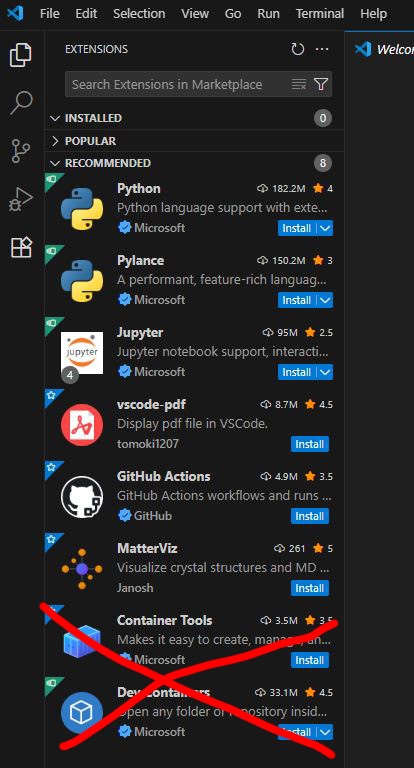
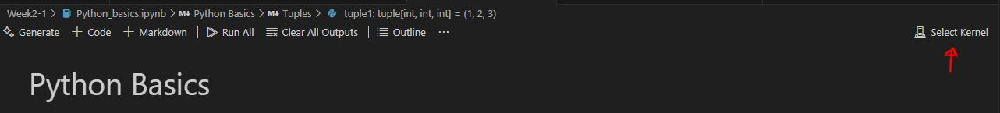
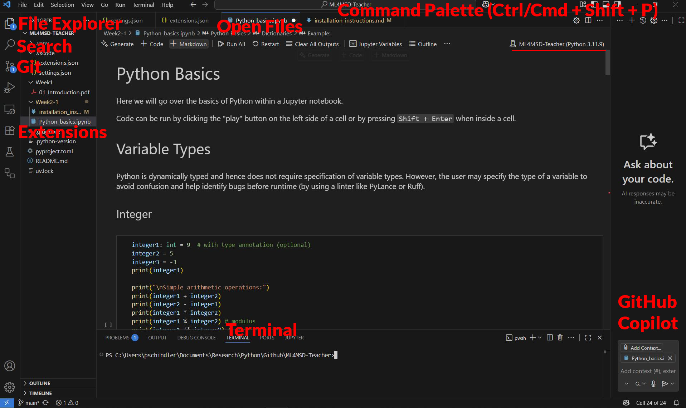

## Prerequisites

You have to have already installed:

- VS Code
- Python (ideally, version 3.11.9 or newer)
- GitHub Desktop

And you already created a GitHub account and sent me your GitHub username.

## Fetch Code from GitHub

- If you haven't already, accept the invite I sent you to gain access to the repository.
- Open the [repository](https://github.com/d2r2group/ML4MSD-Files) and click on green button that says "Code", then click "Open with GitHub Desktop".
- (optional) Choose a (different) folder on your computer where the code will be stored. By default it will be stored in the `GitHub/ML4MSD-Files` folder.

- Click blue button "clone" (and pay attention to the folder where the code will be located on your computer)
- Then click "Fetch origin"

## Installation of UV

### Windows

Installation of *powershell*:

- Open command prompt (Windows key + R, then write "cmd" and hit enter)
- Copy this command and hit enter `winget install --id Microsoft.PowerShell --source winget`
- Now run `powershell Set-ExecutionPolicy RemoteSigned -Scope CurrentUser`

Installation of *UV* 
- Run the following in the command prompt:  
`powershell -ExecutionPolicy ByPass -c "irm https://astral.sh/uv/install.ps1 | iex"`

### Mac

- Press Cmd + spacebar to open Spotlight Search.
- Type "Terminal" and press Enter.
- Run the following command: `curl -LsSf https://astral.sh/uv/install.sh | sh` 
Or, alternatively: `wget -qO- https://astral.sh/uv/install.sh | sh`

## Open Code and VS Code Setup

- Open VS Code

- File > Open Folder - then select the folder `ML4MSD-Files` (where you fetched the code in the previous step)
- Click "Yes" when it asks whether you trust the author (you can trust me...I promise...)
- On the bottom right you can click on "Install" (where it says "Do you want to install the recommended extensions...") and then 
click "Trust Publisher" in case it asks. 

Alternatively, you can install each individual extension by clicking on the extensions panel and click install for each
extension in the "Recommended panel". The recommended ones are:
    - ms-python.python
    - ms-python.vscode-pylance
    - ms-toolsai.jupyter
    - tomoki1207.pdf
    - github.vscode-github-actions
    - janosh.matterviz

## Sync with UV and Select Python Interpreter

- In VS Code click on the top menu: Terminal > New Terminal
- Run `uv sync` in the terminal
- Press Ctrl/Cmd + Shift + P then type "Python: Select Interpreter"
- Open file `Week2/Python_Crash_Course_1.ipynb`. 
- Select the Python interpreter by clicking "Select Kernel" and then "Python Interpreter"

- Select either `Python 3.11.9 (ML4MSD-Files) .\venv\Scripts\python.exe` or `Use Python from 'Python.defaultInterpreterPath' setting .\.venv\Scripts\python` (which refer to the same thing)

