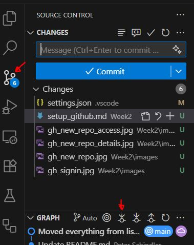
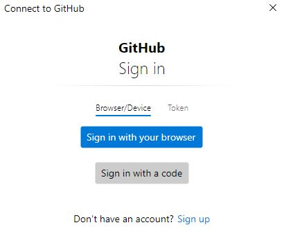
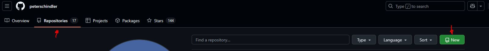
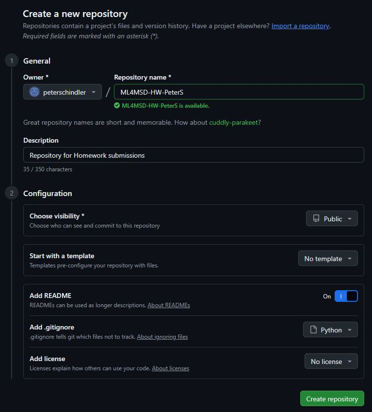
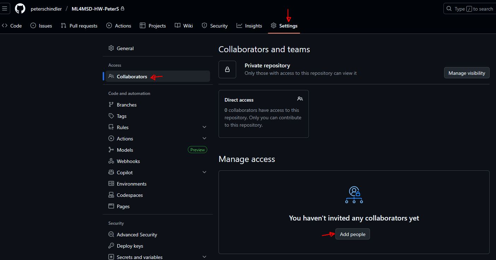
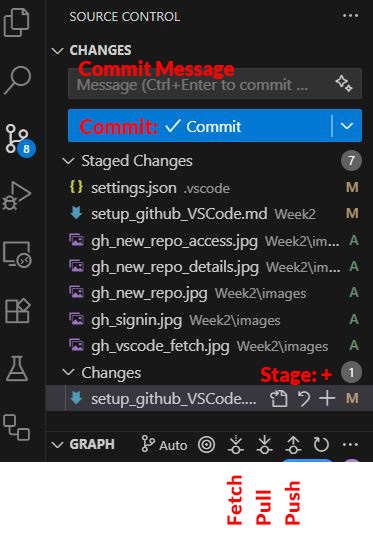

## Installation of git

First check if you have git already installed by running `git --version` in your command prompt.

### Windows

- Download the x64 (or less commonly xARM) standalone installer from [here](https://git-scm.com/downloads/win) (32 bit no longer supported)
- Go through installation. All defaults are fine.
- Alternatively, run the following in the command prompt: `winget install --id Git.Git -e --source winget`

### Mac

**Method 1 (Homebrew):**

- If you don't have homebrew installed you can install it by running:  `/bin/bash -c "$(curl -fsSL https://raw.githubusercontent.com/Homebrew/install/HEAD/install.sh)"`
- Then run `brew install git`

**Method 2 (XCode):**

- git gets automatically installed if you install [XCode](https://apps.apple.com/us/app/xcode/id497799835?mt=12/)

## Setting up GitHub in VSCode

- First change your file name `Python_Crash_Course_1.ipynb` to `Python_Crash_Course_1_completed.ipynb` (so that your changes from last lecture aren't overwritten, in case you want to keep your solutions to the in-class exercises)
- Click on the source control icon and then on the fetch icon (see icons indicated below).

- Now a window should pop up that prompts you to sign into GitHub with your browser. Follow the sign-in process and you should now be able to operate GitHub from within VS Code.

- Alternatively, you may click on the last icon on the left (GitHub Actions) and click on "Sign in to GitHub" which should also prompt the login like above.

## Setting up a repository for homework assignments

- Go to your GitHub profile and click on "Repositories" and then on green button "New"

- Add the following details:

   - Repository name: `ML4MSD-HW-<FirstL>` where FirstL refers to your full first name and last name initial (e.g., PeterS)
   - Description is optional
   - You can select for this repository to visibly to the "Public" or be "Private". Either is fine, but for a Private one additional step will be required such that I can see the content of the repository.
   - No template.
   - Can add a README (optional)
   - Select `Python` for the .gitignore file
   - No license
- Then click green button "Create repository" which creates the repository
- For a Private repository, add access for my username `peterschindler`:   Settings > Collaborators > Add people > type "peterschindler" and add me

## Making your first commit
- Open the `ML4MSD-HW-<FirstL>` in VS Code
- Click the fetch icon in the Source Control panel
- Click the new folder button (top left, folder with a small plus sign) and name it "Homework1"
- Right on the new folder and select "New File..." and name it "test.md"
- Open that file and write something in it
- Click on the "Source Control" icon, and under "Changes" click the + sign next to test.md file. It should now be listed under "Staged Changes" (*note*: only staged changes will be committed)
- Write a message in the top field (above Commit), for example, "Added a test file" and then click Commit
- Lastly, press the Push icon to sync your changes with the remote repository on GitHub

